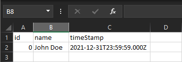
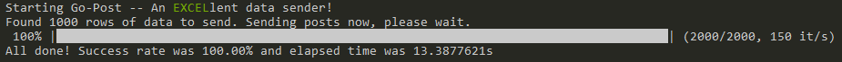
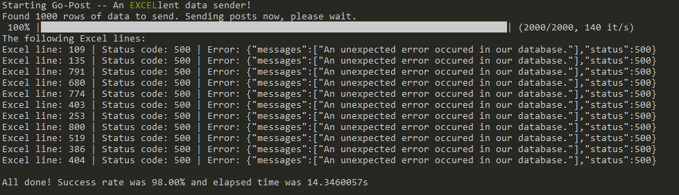

# GO POST

This is a simple application that reads data from an Excel (```.xlsx```) file and for every row, will send a post
request to a given url.

The posts will be made concurrently, so it's a fast process, and you can use this application to do simple stress tests
on your apis.

## Changelog
- ```1.2.0.0``` We have a new application: ```gomongo```. It runs find commands on MongoDb.
- ```1.1.0.0``` We have a new application: ```gohub```. It sends messages to Azure EventHub. 
 


Check [releases](https://github.com/brenordv/go-post/releases) page if you want to download a compiled version.
# GoPost application

## Limitations

1. For now, only flat json structures are supported. (You can bypass this limitation by writing the nested object as
   string value in the cell)

## How does it work

1. Create an Excel file
2. On any sheet, in the first line, write the name of the properties of your json, the way they need to be written.
3. Each row after the first will generate a json object (using the names on the first row as keys) and will be used on a
   post request
4. The data must be written the way you want to send it. If you want to send a datetime in UTC format, write it that
   way.
5. You can use formulas to format and treat your data. GoPost will read the final value of the cell.
6. The workbook may have as many sheets as you want, as long as the sheet used for posts contains only the required
   data. Loose columns and values in that sheet may cause errors.

## How to use

### Step 1: Create the Excel file with your post data.

If you want to send posts with the following json body:

```json
{
  "id": 0,
  "name": "John Doe",
  "timeStamp": "2021-12-31T23:59:59.000Z"
}
```

Your Excel should look like this:



Once you've added all data you want to the Excel file, we can go to the next step.

### Step 2: Run the application.

To use this application, you must provide a few command line arguments.

1. The url you want to use
2. Path for the Excel file
3. (Optional, default 2) Size of the buffer that will be used. Higher means faster + more resources used on your
   machine.
4. (Optional, default 'Sheet1') Name of the sheet that contains your data.

Example:

```shell
go-post --url https://localhost:44319/api/v1/cars --file .tmp\pu_payload.xlsx
```

To review available args and their default values:

```shell
go-post --help
```


## Performance

On local tests I got an average rate of 1 request every 0.013 seconds.

## Demo

### Success



### Error



## TODO

1. Add a flag to pass token for authenticated requests.

# GoHub application

## Limitations

1. The only tested use case for this application was to send CSV file content to an Azure EventHub topic.

## How does it work

1. Create a folder for your payload files.
2. Create a text file for each message you want to send.
3. Each file will be sent whole to AzureEventHub. It will not be treated in any way.

## How to use
### Step 1: Create the payload files

Create a folder and then create the files you want to send to AzureEventHub.


### Step 2: Run the application.

To use this application, you must provide a few command line arguments.

1. Path for the payload files
2. (Optional, default 2) Size of the buffer that will be used. Higher means faster + more resources used on your
   machine.
3. (Optional, default 'read from file') Azure EventHub connection string. If not provided, will try to read from a file called ```eventhub.conn.txt```.

Example:

```shell
go-hub --path .tmp\path-to-text-files\
```

To review available args and their default values:

```shell
go-hub --help
```

## Performance

On local tests I got an average rate of 1 file sent every 0.02 seconds.


# GoMongo application

Created to stress test (kind of) a MongoDb (CosmosDb on Azure). 
Wanted to see how many requests it can handle before breaking apart. 

## Limitations

1. So far, only simple find queries work.

## How does it work

1. Use the application from CLI and wait results.

## How to use
### Step 1: Run the application.

To use this application, you must provide a few command line arguments.

1. The query that will be passed to Find function.
2. How many requests should be sent.
3. Name of the database
4. Name of the collection.
5. (Optional, default false) If should re-use a single connection.   
6. (Optional, default 1) Delay (in milliseconds) between each request.
7. (Optional, default 2) Size of the buffer that will be used. Higher means faster + more resources used on your
   machine.
8. (Optional, default 'read from file') MongoDb connection string. If not provided, will try to read from a file called ```mongodb.conn.txt```.

Example:

```shell
go-mongo --database admin --collection MyCollection --query "{\"Code\": {\"$regex\": \".*200168T4G3.*\"}}" --single-conn --delay 5 --requests 10000
```

To review available args and their default values:

```shell
go-mongo --help
```

## Performance
Not measured yet.


# Final notes
I noticed that i got a little carried away and now this repo has multiple applications that work in completely different ways. Sorry about that.

I have just learnt Golang and this is my first project. Any and all feedbacks are appreciated!
Thanks!